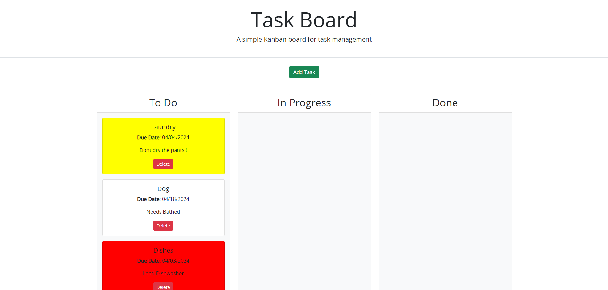
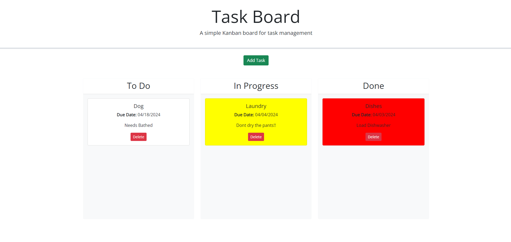

# Task Board

## Description

This Task Board allows you to make tasks with due dates and put them into different sections depending on the progress of the task. It helps keep and tracdk order in your life!

- This developement helped me understand local storage better
- I made this to bring a little bit more order to my "Chores" around the home.
- It helps keep my brain clear of all the clutter I have to do on a daily basis.
- I learned a lot about API's and CSS through this venture.

## Usage

Here is a snippet of the webpage with tasks going to their default position in the "To Do" section.

Here is another screenshot showing that the objects are movable and can be placed in whatever area of the progression sheet you need.

## Link to Deployed application

https://thekylekirby.github.io/Task-Board/ 